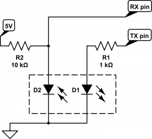

# Kamstrup Multical Electrical Meter Data Extractor
This sketch is tested and fully functional on a Kamstrup Omnipower 684, but should work with the older Multical 382 meters as well

# BOM
I used these parts:
<ul>
    <li>D1/D2 TCRT5000 IR sensor: https://trab.dk/sensorer/47-ir-reflektiv-optisk-sensor.html</li>
    <li>R1 1K ohm</li>
    <li>R2 10K ohm</li>
    <li>Arduino board Nano: https://trab.dk/boards/12-nano.html</li>
</ul>

# Connection
RX pin are connected to D7 and TX pin to D6. 
VCC(+5v) are connected to 5V pin and GND to GND 

# Notes
I had great difficulties getting this to work with the latest board definitions in the Arduino IDE. 
The ones I have successfully used are versions no later than 1.6.21
